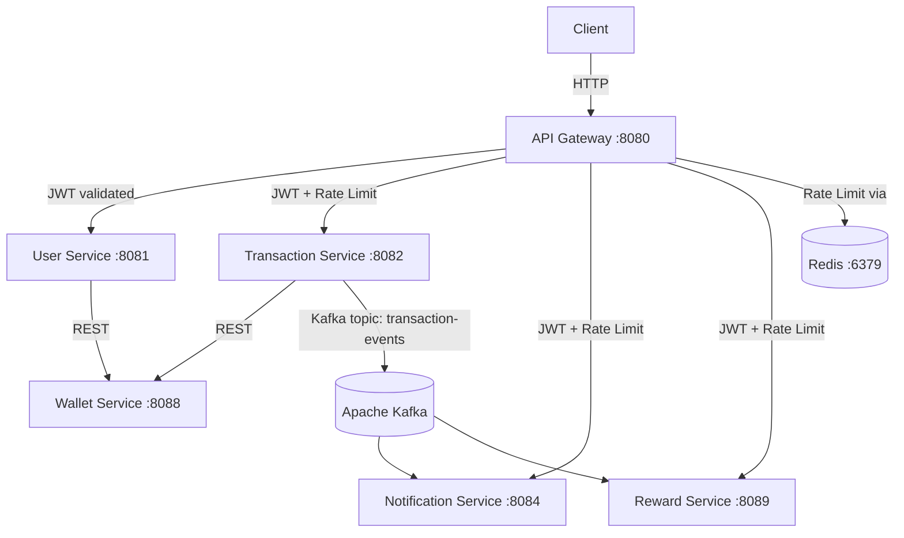

# Payment Integration Spring Boot — Codebase Overview

> A **PayPal-clone** built as a **microservices system** using Spring Boot 3.5, Java 17, Kafka, and Spring Cloud Gateway.

---

## 🏗️ High-Level Architecture



---

## 📦 Services At a Glance

| Service | Port | DB | Role |
|---|---|---|---|
| **api-gateway** | 8080 | — | Entry point, JWT auth, rate limiting |
| **user-service** | 8081 | H2 in-memory | Auth (signup/login), JWT issuance |
| **transaction-service** | 8082 | H2 in-memory | Orchestrates money transfers |
| **wallet-service** | 8088 | H2 in-memory | Holds balances, executes debits/credits |
| **notification-service** | 8084 | H2 in-memory | Kafka consumer → stores notifications |
| **reward-service** | 8089 | — | Kafka consumer → grants rewards on transactions |

---

## 🔐 1. API Gateway (`api-gateway`)

**Port:** `8080` | **Type:** Spring Cloud Gateway (reactive/WebFlux)

### Key Files
- [`JwtAuthFilter.java`](file:///c:/mobile%20photos/MJ/Download.2/Payment_Integration_Spring_Boot-main/Payment_Integration_Spring_Boot-main/api-gateway/src/main/java/com/paypal/api_gateway/filters/JwtAuthFilter.java) — Global filter; validates JWT on every request except `/auth/**`
- [`JwtUtil.java`](file:///c:/mobile%20photos/MJ/Download.2/Payment_Integration_Spring_Boot-main/Payment_Integration_Spring_Boot-main/api-gateway/src/main/java/com/paypal/api_gateway/util/JwtUtil.java) — Token validation logic
- [`RateLimitConfig.java`](file:///c:/mobile%20photos/MJ/Download.2/Payment_Integration_Spring_Boot-main/Payment_Integration_Spring_Boot-main/api-gateway/src/main/java/com/paypal/api_gateway/config/RateLimitConfig.java) — Redis-backed rate limiter config
- [`application.yml`](file:///c:/mobile%20photos/MJ/Download.2/Payment_Integration_Spring_Boot-main/Payment_Integration_Spring_Boot-main/api-gateway/src/main/resources/application.yml) — Route definitions

### Routing Rules
| Path | Downstream | Rate Limit |
|---|---|---|
| `/auth/**` | user-service (:8081) | ❌ None |
| `/api/transactions/**` | transaction-service (:8082) | ✅ 10 req/s, burst 20 |
| `/api/rewards/**` | reward-service (:8085) | ✅ 10 req/s, burst 20 |
| `/api/notifications/**` | notification-service (:8084) | ✅ 10 req/s, burst 20 |

### Auth Flow
1. Extracts `Authorization: Bearer <token>` header
2. Validates JWT → extracts `userId`, `email`, `role`
3. Forwards downstream with `X-User-Id`, `X-User-Email`, `X-User-Role` headers

---

## 👤 2. User Service (`user-service`)

**Port:** `8081` | **DB:** H2 in-memory

### Key Files
- [`AuthController.java`](file:///c:/mobile%20photos/MJ/Download.2/Payment_Integration_Spring_Boot-main/Payment_Integration_Spring_Boot-main/user-service/src/main/java/com/paypal/user_service/controller/AuthController.java) — `POST /auth/signup`, `POST /auth/login`
- [`UserController.java`](file:///c:/mobile%20photos/MJ/Download.2/Payment_Integration_Spring_Boot-main/Payment_Integration_Spring_Boot-main/user-service/src/main/java/com/paypal/user_service/controller/UserController.java) — User profile endpoints
- [`UserServiceImpl.java`](file:///c:/mobile%20photos/MJ/Download.2/Payment_Integration_Spring_Boot-main/Payment_Integration_Spring_Boot-main/user-service/src/main/java/com/paypal/user_service/service/UserServiceImpl.java) — Business logic
- [`JWTUtil.java`](file:///c:/mobile%20photos/MJ/Download.2/Payment_Integration_Spring_Boot-main/Payment_Integration_Spring_Boot-main/user-service/src/main/java/com/paypal/user_service/util/JWTUtil.java) — Token generation
- [`JWTrequestFilter.java`](file:///c:/mobile%20photos/MJ/Download.2/Payment_Integration_Spring_Boot-main/Payment_Integration_Spring_Boot-main/user-service/src/main/java/com/paypal/user_service/util/JWTrequestFilter.java) — Servlet filter for internal auth
- [`SecurityConfig.java`](file:///c:/mobile%20photos/MJ/Download.2/Payment_Integration_Spring_Boot-main/Payment_Integration_Spring_Boot-main/user-service/src/main/java/com/paypal/user_service/security/SecurityConfig.java) — Spring Security configuration
- [`WalletClient.java`](file:///c:/mobile%20photos/MJ/Download.2/Payment_Integration_Spring_Boot-main/Payment_Integration_Spring_Boot-main/user-service/src/main/java/com/paypal/user_service/client/WalletClient.java) — REST client to auto-create wallet on signup

### Signup Flow
1. User registers → `User` entity saved to H2
2. Calls `WalletClient` → creates a wallet for the new user in Wallet Service
3. Returns JWT on login

---

## 💸 3. Transaction Service (`transaction-service`)

**Port:** `8082` | **DB:** H2 in-memory | **Kafka:** Producer

### Key Files
- [`TransactionController.java`](file:///c:/mobile%20photos/MJ/Download.2/Payment_Integration_Spring_Boot-main/Payment_Integration_Spring_Boot-main/transaction-service/src/main/java/com/paypal/transaction_service/controller/TransactionController.java) — REST endpoints (`POST /api/transactions`, `GET /api/transactions/{id}`)
- [`TransactionServiceImpl.java`](file:///c:/mobile%20photos/MJ/Download.2/Payment_Integration_Spring_Boot-main/Payment_Integration_Spring_Boot-main/transaction-service/src/main/java/com/paypal/transaction_service/service/TransactionServiceImpl.java) — Core orchestration logic
- [`KafkaEventProducer.java`](file:///c:/mobile%20photos/MJ/Download.2/Payment_Integration_Spring_Boot-main/Payment_Integration_Spring_Boot-main/transaction-service/src/main/java/com/paypal/transaction_service/kafka/KafkaEventProducer.java) — Publishes to `transaction-events` topic
- [`WalletClient.java`](file:///c:/mobile%20photos/MJ/Download.2/Payment_Integration_Spring_Boot-main/Payment_Integration_Spring_Boot-main/transaction-service/src/main/java/com/paypal/transaction_service/client/WalletClient.java) — REST calls to Wallet Service

### Money Transfer Flow (2-Phase Commit Pattern)
```
1. Save transaction as PENDING
2. POST /wallets/hold        → reserve funds (reduce availableBalance)
3. GET  /wallets/{receiverId} → validate receiver exists
4. POST /wallets/capture     → debit sender (reduce balance)
5. POST /wallets/credit      → credit receiver
6. Update transaction → SUCCESS
7. Publish Kafka event → transaction-events
   └── Compensating logic: if any step fails → releaseHold / refund sender → mark FAILED
```

---

## 👛 4. Wallet Service (`wallet-service`)

**Port:** `8088` | **DB:** H2 in-memory

### Key Files
- [`WalletController.java`](file:///c:/mobile%20photos/MJ/Download.2/Payment_Integration_Spring_Boot-main/Payment_Integration_Spring_Boot-main/wallet-service/src/main/java/com/paypal/wallet_service/controller/WalletController.java) — REST API for wallet ops
- [`WalletService.java`](file:///c:/mobile%20photos/MJ/Download.2/Payment_Integration_Spring_Boot-main/Payment_Integration_Spring_Boot-main/wallet-service/src/main/java/com/paypal/wallet_service/service/WalletService.java) — Core wallet logic
- [`HoldExpiryScheduler.java`](file:///c:/mobile%20photos/MJ/Download.2/Payment_Integration_Spring_Boot-main/Payment_Integration_Spring_Boot-main/wallet-service/src/main/java/com/paypal/wallet_service/scheduler/HoldExpiryScheduler.java) — Scheduled job to auto-release expired holds

### Entities
| Entity | Description |
|---|---|
| `Wallet` | userId, currency, balance, availableBalance |
| `WalletHold` | holdReference, amount, status (ACTIVE/CAPTURED/RELEASED), expiry |
| `Transaction` | walletId, type (CREDIT/DEBIT), amount, status |

### Key Operations
| Endpoint | Action |
|---|---|
| `POST /api/v1/wallets` | Create wallet |
| `GET /api/v1/wallets/{userId}` | Get wallet by userId |
| `POST /api/v1/wallets/credit` | Add funds |
| `POST /api/v1/wallets/debit` | Remove funds |
| `POST /api/v1/wallets/hold` | Reserve funds (2-phase) |
| `POST /api/v1/wallets/capture` | Finalize hold → debit |
| `POST /api/v1/wallets/release/{holdRef}` | Cancel hold |

---

## 🔔 5. Notification Service (`notification-service`)

**Port:** `8084` | **DB:** H2 in-memory | **Kafka:** Consumer

### Key Files
- [`NotificationConsumer.java`](file:///c:/mobile%20photos/MJ/Download.2/Payment_Integration_Spring_Boot-main/Payment_Integration_Spring_Boot-main/notification-service/src/main/java/com/paypal/notification_service/kafka/NotificationConsumer.java) — Listens on `transaction-events` topic
- [`NotificationService.java`](file:///c:/mobile%20photos/MJ/Download.2/Payment_Integration_Spring_Boot-main/Payment_Integration_Spring_Boot-main/notification-service/src/main/java/com/paypal/notification_service/service/NotificationService.java) / [`NotificationServiceImpl.java`](file:///c:/mobile%20photos/MJ/Download.2/Payment_Integration_Spring_Boot-main/Payment_Integration_Spring_Boot-main/notification-service/src/main/java/com/paypal/notification_service/service/NotificationServiceImpl.java) — Saves notification records
- [`NotificationController.java`](file:///c:/mobile%20photos/MJ/Download.2/Payment_Integration_Spring_Boot-main/Payment_Integration_Spring_Boot-main/notification-service/src/main/java/com/paypal/notification_service/controller/NotificationController.java) — GET endpoints to query notifications

**Kafka Group ID:** `notification-group`

---

## 🎁 6. Reward Service (`reward-service`)

**Port:** `8089` | **Kafka:** Consumer

### Key Files
- [`RewardConsumer.java`](file:///c:/mobile%20photos/MJ/Download.2/Payment_Integration_Spring_Boot-main/Payment_Integration_Spring_Boot-main/reward-service/src/main/java/com/paypal/reward_service/kafka/RewardConsumer.java) — Listens on `transaction-events` topic
- [`RewardService.java`](file:///c:/mobile%20photos/MJ/Download.2/Payment_Integration_Spring_Boot-main/Payment_Integration_Spring_Boot-main/reward-service/src/main/java/com/paypal/reward_service/service/RewardService.java) / [`RewardServiceImpl.java`](file:///c:/mobile%20photos/MJ/Download.2/Payment_Integration_Spring_Boot-main/Payment_Integration_Spring_Boot-main/reward-service/src/main/java/com/paypal/reward_service/service/RewardServiceImpl.java)
- [`RewardController.java`](file:///c:/mobile%20photos/MJ/Download.2/Payment_Integration_Spring_Boot-main/Payment_Integration_Spring_Boot-main/reward-service/src/main/java/com/paypal/reward_service/controller/RewardController.java)

**Kafka Group ID:** `reward-group`
**Entity:** `Reward` — tracks reward points per user/transaction

---

## 🔁 Event Flow (Kafka)

```
Transaction Service
       │
       │ publishes JSON to topic: transaction-events
       ▼
    Kafka Broker (:9092)
       ├── notification-group → Notification Service
       │       └── saves Notification record to H2
       └── reward-group → Reward Service
               └── grants reward points to sender
```

---

## 🐳 Infrastructure (`docker-compose.yml`)

Spins up:
- **Zookeeper** (port 2181)
- **Kafka** (port 9092)

> [!NOTE]
> All microservices use **H2 in-memory databases** (no persistence across restarts). Redis is required separately for the API gateway rate limiter.

---

## 🔑 Security Model

| Layer | Mechanism |
|---|---|
| API Gateway | JWT `GlobalFilter` — validates token, forwards user claims as headers |
| User Service | Spring Security + `JWTrequestFilter` (servlet filter) |
| Other Services | Trust headers (`X-User-Id`, `X-User-Email`) forwarded by gateway |

**JWT Secret:** `my-super-secret-key-that-you-never-share` (hardcoded in `application.yml`)

---

## 🗂️ Project Build Structure

```
paypal-clone (Maven multi-module, POM packaging)
├── api-gateway/
├── user-service/
├── transaction-service/
├── wallet-service/
├── notification-service/
└── reward-service/
```

- **Java:** 17
- **Spring Boot:** 3.5.0
- **Build:** Maven (each service has its own `pom.xml` + `mvnw`)

---

## ⚠️ Notable Design Decisions

> [!IMPORTANT]
> The transaction service uses a **manual 2-phase commit** via HTTP REST calls (Hold → Capture → Credit). This is NOT atomic — partial failures are handled with compensating transactions (refund to sender), but there is no distributed transaction manager (e.g., Saga orchestrator).

> [!WARNING]
> The **Wallet Service port** is `8088` in its own config but the API Gateway routes transaction-service to `:8082` — the wallet service is called **directly** by transaction-service via `RestTemplate` at `http://localhost:8088`, bypassing the gateway.

> [!TIP]
> The `HoldExpiryScheduler` in wallet-service automatically releases stale holds, preventing funds from being locked indefinitely if a transaction never completes.
